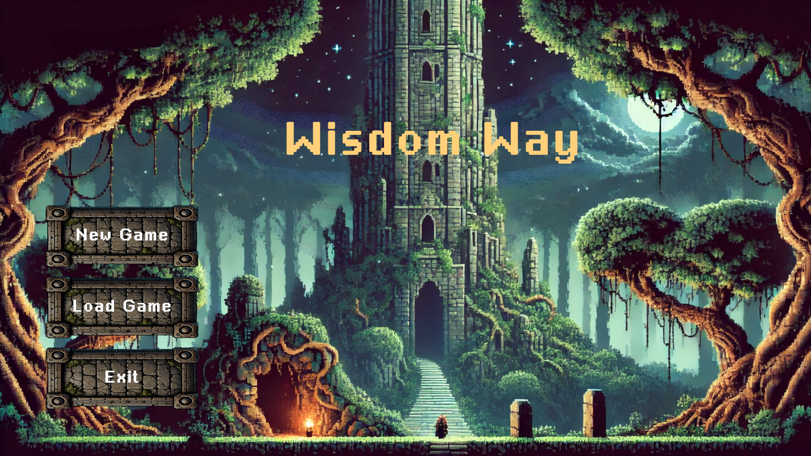

# Wisdom Way

Wisdom Way is a 2D pixel art top-down game, developed over two semesters as a university project.

Your mission is to defeat the wizard at the top of the tower.
The tower consists of five layers, each representing a different area of knowledge.
On your journey to the top, you will face monsters, puzzles, and challenges.

## Features

- Player movement: run, dash, and attack
- Enemy encounters
- Collectable items
- Puzzles to solve
- Five unique tower layers
- Save & exit functionality

## Used Technologies

- Unity
- C#
- GitHub
- Visual Studio Code

## Installation

- Install Unity (Unity 2022.3.33f1 LTS)
- Clone the Repository and open it with Unit

## Contributors

- Nasser
- Lukas
- Mihoshi
- Sinan
